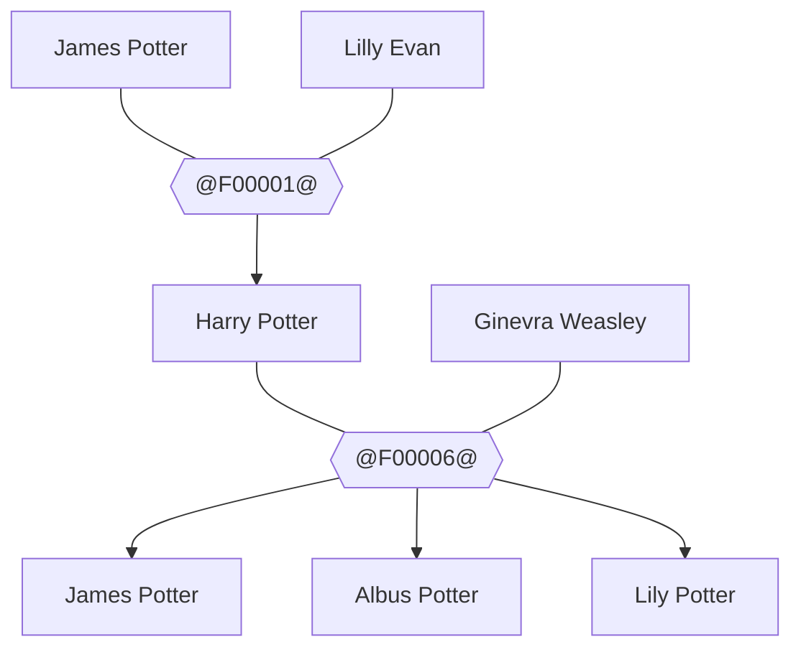

# Harry Potter family tree — Mermaid example

This is the output of running `gedcom_to_mermaid` against the public
[Harry Potter GEDCOM sample](https://github.com/findmypast/gedcom-samples).
GitHub renders the fenced `mermaid` blocks below directly.

```sh
dart run bin/gedcom_to_mermaid.dart \
  "test/samples/gedcom-samples/Harry Potter.ged" \
  -o harry_potter.mmd
```

## Focused view — Harry's nuclear family

A hand-curated subset showing Harry, his parents, his wife Ginny, and
their three children.



## Full tree

The renderer produces 114 individuals and 42 families for this sample.

```mermaid
flowchart TD
  I00001["Harry Potter"]
  I00071["Black"]
  I00084["Alphard Black"]
  I00098["Andromeda Black"]
  I00049["Arcturus Black<br/>1884–1959"]
  I00088["Arcturus Black<br/>1901–1991"]
  I00097["Bellatrix Black<br/>1951–1998"]
  I00061["Belvina Black<br/>1886–1962"]
  I00051["Callidora Black<br/>1915–"]
  I00077["Cassiopeia Black<br/>1915–1992"]
  I00036["Cedrella Black"]
  I00052["Charis Black<br/>1919–1973"]
  I00062["Cygnus Black<br/>1889–1943"]
  I00085["Cygnus Black<br/>1929–1979"]
  I00079["Dorea Black<br/>1920–1977"]
  I00074["Elladora Black<br/>1850–1931"]
  I00072["Isla Black"]
  I00092["Lucretia Black<br/>1925–1992"]
  I00089["Lycoris Black<br/>1904–1965"]
  I00078["Marius Black"]
  I00099["Narcissa Black<br/>1955–"]
  I00093["Orion Black<br/>1929–1979"]
  I00063["Phineas Black"]
  I00060["Phineas Nigellus Black<br/>1847–1925"]
  I00076["Pollux Black<br/>1912–1990"]
  I00090["Regulus Black<br/>1906–1959"]
  I00095["Regulus Black<br/>1961–1979"]
  I00064["Sirius Black<br/>1877–1952"]
  I00075["Sirius Black<br/>1843–1853"]
  I00094["Sirius Black"]
  I00083["Walburga Black<br/>1925–1985"]
  I00069["Violetta Bulstrode"]
  I00068["Female Burke"]
  I00065["Herbert Burke"]
  I00066["Male Burke"]
  I00067["Male Burke"]
  I00080["Irma Crabbe"]
  I00053["Caspar Crouch"]
  I00055["Female Crouch"]
  I00056["Female Crouch"]
  I00054["Mollie Crouch"]
  I00033["Apolline Delacour"]
  I00029["Fleur Delacour"]
  I00034["Gabrielle Delacour"]
  I00032["Monsieur Delacour"]
  I00010["Dudley Dursley"]
  I00011["Mr. Dursley"]
  I00012["Mrs. Dursley"]
  I00009["Vernon Dursley"]
  I00003["Lilly Evan"]
  I00006["Mr. Evans"]
  I00007["Mrs. Evans"]
  I00008["Petunia Evans"]
  I00039["Peverell Family"]
  I00070["Ursula Flint"]
  I00087["Hesper Gamp"]
  I00044["Marvolo Gaunt"]
  I00046["Merope Gaunt"]
  I00045["Morfin Gaunt"]
  I00025["Hermione Granger"]
  I00073["Bob Hitchens"]
  I00103["Rodolphus Lestrange"]
  I00059["Female Longbottom"]
  I00057["Harfang Longbottom"]
  I00058["Male Longbottom"]
  I00106["Remus Lupin"]
  I00107["Ted Lupin"]
  I00091["Melania Macmillan"]
  I00101["Draco Malfoy<br/>1980–"]
  I00100["Lucius Malfoy"]
  I00102["Scorpius Malfoy"]
  I00041["Antioch Peverell"]
  I00040["Cadmus Peverell"]
  I00038["Ignotus Peverell"]
  I00042["Many Generations Peverell"]
  I00015["Albus Potter"]
  I00081["Charlus Potter"]
  I00002["James Potter"]
  I00014["James Potter"]
  I00016["Lily Potter"]
  I00082["Male Potter"]
  I00037["Many Generations Potter"]
  I00004["Mr. Potter"]
  I00005["Mrs. Potter"]
  I00108["Prewett"]
  I00112["Fabian Prewett"]
  I00110["Female Prewett"]
  I00111["Gideon Prewett"]
  I00096["Ignatius Prewett"]
  I00109["Male Prewett"]
  I00017["Molly Prewett"]
  I00048["Tom Marvolo Riddle"]
  I00047["Tom Riddle"]
  I00086["Druella Rosier"]
  I00043["Many Generations Slytherin"]
  I00114["Salazar Slytherin"]
  I00105["Nymphadora Tonks"]
  I00104["Ted Tonks"]
  I00018["Arthur Weasley"]
  I00113["Bilius Weasley"]
  I00023["Charles Weasley"]
  I00021["Fred Weasley"]
  I00028["Fred Weasley"]
  I00020["George Weasley"]
  I00013["Ginevra Weasley"]
  I00027["Hugo Weasley"]
  I00031["Other Children Weasley"]
  I00022["Percy Weasley"]
  I00019["Ronald Weasley"]
  I00026["Rose Weasley"]
  I00035["Septimus Weasley"]
  I00030["Victoire Weasley"]
  I00024["William Weasley"]
  I00050["Lysandra Yaxley"]
  F00001{{"@F00001@"}}
  I00002 --- F00001
  I00003 --- F00001
  F00001 --> I00001
  F00002{{"@F00002@"}}
  I00004 --- F00002
  I00005 --- F00002
  F00002 --> I00002
  F00003{{"@F00003@"}}
  I00006 --- F00003
  I00007 --- F00003
  F00003 --> I00003
  F00003 --> I00008
  F00004{{"@F00004@"}}
  I00009 --- F00004
  I00008 --- F00004
  F00004 --> I00010
  F00005{{"@F00005@"}}
  I00011 --- F00005
  I00012 --- F00005
  F00005 --> I00009
  F00006{{"@F00006@"}}
  I00001 --- F00006
  I00013 --- F00006
  F00006 --> I00014
  F00006 --> I00015
  F00006 --> I00016
  F00007{{"@F00007@"}}
  I00018 --- F00007
  I00017 --- F00007
  F00007 --> I00013
  F00007 --> I00019
  F00007 --> I00020
  F00007 --> I00021
  F00007 --> I00022
  F00007 --> I00023
  F00007 --> I00024
  F00008{{"@F00008@"}}
  I00019 --- F00008
  I00025 --- F00008
  F00008 --> I00026
  F00008 --> I00027
  F00009{{"@F00009@"}}
  I00020 --- F00009
  F00009 --> I00028
  F00010{{"@F00010@"}}
  I00024 --- F00010
  I00029 --- F00010
  F00010 --> I00030
  F00010 --> I00031
  F00011{{"@F00011@"}}
  I00032 --- F00011
  I00033 --- F00011
  F00011 --> I00029
  F00011 --> I00034
  F00012{{"@F00012@"}}
  I00035 --- F00012
  I00036 --- F00012
  F00012 --> I00018
  F00012 --> I00113
  F00013{{"@F00013@"}}
  I00037 --- F00013
  F00013 --> I00004
  F00014{{"@F00014@"}}
  I00038 --- F00014
  F00014 --> I00037
  F00015{{"@F00015@"}}
  I00039 --- F00015
  F00015 --> I00038
  F00015 --> I00040
  F00015 --> I00041
  F00016{{"@F00016@"}}
  I00040 --- F00016
  F00016 --> I00042
  F00017{{"@F00017@"}}
  I00042 --- F00017
  I00043 --- F00017
  F00017 --> I00044
  F00018{{"@F00018@"}}
  I00044 --- F00018
  F00018 --> I00045
  F00018 --> I00046
  F00019{{"@F00019@"}}
  I00047 --- F00019
  I00046 --- F00019
  F00019 --> I00048
  F00020{{"@F00020@"}}
  I00049 --- F00020
  I00050 --- F00020
  F00020 --> I00036
  F00020 --> I00051
  F00020 --> I00052
  F00021{{"@F00021@"}}
  I00053 --- F00021
  I00052 --- F00021
  F00021 --> I00054
  F00021 --> I00055
  F00021 --> I00056
  F00022{{"@F00022@"}}
  I00057 --- F00022
  I00051 --- F00022
  F00022 --> I00058
  F00022 --> I00059
  F00023{{"@F00023@"}}
  I00060 --- F00023
  I00070 --- F00023
  F00023 --> I00049
  F00023 --> I00061
  F00023 --> I00062
  F00023 --> I00063
  F00023 --> I00064
  F00024{{"@F00024@"}}
  I00065 --- F00024
  I00061 --- F00024
  F00024 --> I00066
  F00024 --> I00067
  F00024 --> I00068
  F00025{{"@F00025@"}}
  I00062 --- F00025
  I00069 --- F00025
  F00025 --> I00076
  F00025 --> I00077
  F00025 --> I00078
  F00025 --> I00079
  F00026{{"@F00026@"}}
  I00071 --- F00026
  F00026 --> I00060
  F00026 --> I00072
  F00026 --> I00073
  F00026 --> I00074
  F00026 --> I00075
  F00027{{"@F00027@"}}
  I00076 --- F00027
  I00080 --- F00027
  F00027 --> I00083
  F00027 --> I00084
  F00027 --> I00085
  F00028{{"@F00028@"}}
  I00081 --- F00028
  I00079 --- F00028
  F00028 --> I00082
  F00029{{"@F00029@"}}
  I00085 --- F00029
  I00086 --- F00029
  F00029 --> I00097
  F00029 --> I00098
  F00029 --> I00099
  F00030{{"@F00030@"}}
  I00064 --- F00030
  I00087 --- F00030
  F00030 --> I00088
  F00030 --> I00089
  F00030 --> I00090
  F00031{{"@F00031@"}}
  I00088 --- F00031
  I00091 --- F00031
  F00031 --> I00092
  F00031 --> I00093
  F00032{{"@F00032@"}}
  I00093 --- F00032
  I00083 --- F00032
  F00032 --> I00094
  F00032 --> I00095
  F00033{{"@F00033@"}}
  I00096 --- F00033
  I00092 --- F00033
  F00034{{"@F00034@"}}
  I00100 --- F00034
  I00099 --- F00034
  F00034 --> I00101
  F00035{{"@F00035@"}}
  I00101 --- F00035
  F00035 --> I00102
  F00036{{"@F00036@"}}
  I00103 --- F00036
  I00097 --- F00036
  F00037{{"@F00037@"}}
  I00104 --- F00037
  I00098 --- F00037
  F00037 --> I00105
  F00038{{"@F00038@"}}
  I00106 --- F00038
  I00105 --- F00038
  F00038 --> I00107
  F00039{{"@F00039@"}}
  I00108 --- F00039
  F00039 --> I00096
  F00039 --> I00109
  F00040{{"@F00040@"}}
  I00109 --- F00040
  I00110 --- F00040
  F00040 --> I00017
  F00040 --> I00111
  F00040 --> I00112
  F00041{{"@F00041@"}}
  I00073 --- F00041
  I00072 --- F00041
  F00042{{"@F00042@"}}
  I00114 --- F00042
  F00042 --> I00043
```


